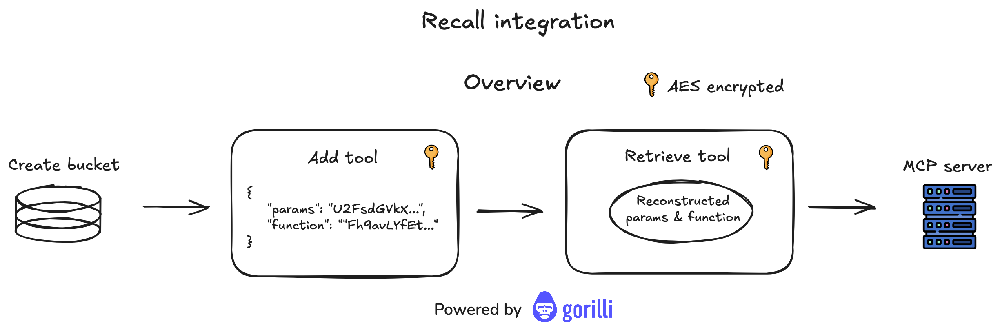

# 🌪️ Storm MCP Marketplace

[](LICENSE)
[](https://gorilli.ai)
[]()

> A decentralized marketplace connecting developers and users through MCP tools, enabling publishing and discovery via Recall and creating a seamless ecosystem for specialized AI capabilities.

## 📋 Overview

Storm is a decentralized marketplace for AI tools where developers can publish and monetize their Model Context Protocol (MCP) tools directly. Consumers access these tools through token-based payments, creating an ecosystem that rewards developers while providing users with diverse AI capabilities.

The platform uses AES encryption for secure tool storage and transmission, and integrates with Recall.

## ✨ Key Features

| 🔒 **Developer Monetization**                                  | 🛍️ **Consumer Access**                                                   | 📝 **Transparent Source Code**                      |
| -------------------------------------------------------------- | ------------------------------------------------------------------------ | --------------------------------------------------- |
| Publish your MCP tools and earn tokens when consumers use them | Use a variety of specialized AI tools through a single unified interface | Option to showcase tool source code in the frontend |

| 🔌 **Simple Integration**                                  | 🔐 **AES Encryption**                                        | 📦 **Tool Buckets**                                    |
| ---------------------------------------------------------- | ------------------------------------------------------------ | ------------------------------------------------------ |
| Easy to install and use with platforms like Claude Desktop | Industry-standard security for tool parameters and functions | Organized storage system for efficient tool management |

## 🏗️ Technical Architecture

### Tool Management Flow



The Storm platform uses the following workflow to securely store and retrieve tools:

1. **Create Bucket**: Initialize storage for new tools
2. **Add Tool**: Encrypt tool parameters and functions with AES before storage
3. **Retrieve Tool**: Securely retrieve and decrypt tools when needed
4. **MCP Server Integration**: Seamlessly connect with MCP servers for tool execution

### Tool Bucket Structure


Tools in Storm are organized in buckets with detailed component information:

- Tool name
- Parameter schemas with validation rules
- Function implementations
- Secure access controls

### Detailed Tool Processing Workflow


When a developer adds a new tool to Storm:

1. Parameters and function bodies are separated
2. Each component is serialized to JSON/string format
3. AES encryption is applied to both components
4. The encrypted components are combined into a single object
5. The tool is stored in the appropriate bucket

### Tool Retrieval and Execution


When a user requests a tool:

1. The encrypted tool is retrieved from the bucket
2. Decryption is performed using the appropriate keys
3. Parameters and functions are reconstructed
4. Zod schema validation ensures security and correctness
5. The tool is made available to the MCP server for execution

## 🚀 How It Works

### For Developers

| Step | Description                                                                  |
| ---- | ---------------------------------------------------------------------------- |
| 1️⃣   | **Create Your Tool**: Develop your MCP-compatible tool using the Storm SDK   |
| 2️⃣   | **Configure Parameters**: Define the input parameters and validation rules   |
| 3️⃣   | **Implement Function**: Write the core functionality that your tool provides |
| 4️⃣   | **Publish to Marketplace**: Submit your tool with pricing information        |
| 5️⃣   | **Monitor Usage**: Track usage statistics and token earnings                 |

### For Consumers

| Step | Description                                                                          |
| ---- | ------------------------------------------------------------------------------------ |
| 1️⃣   | **Install Storm**: Set up the Storm MCP server on your system                        |
| 2️⃣   | **Fund Your Wallet**: Ensure your wallet has sufficient Recall tokens                |
| 3️⃣   | **Browse Tools**: Explore available tools in the marketplace                         |
| 4️⃣   | **Use Tools via AI**: Make queries to your AI assistant that leverage Storm tools    |
| 5️⃣   | **Automatic Payments**: Micropayments are processed automatically to tool developers |

## 🔒 Security Features

| 🔐 **AES Encryption**                                             | 🔑 **Secure Key Management**      | 🔒 **Access Controls**               |
| ----------------------------------------------------------------- | --------------------------------- | ------------------------------------ |
| All tool code and parameters are encrypted at rest and in transit | Advanced key rotation and storage | Granular permissions for tool access |

| 📝 **Audit Logging**                    | ✅ **Parameter Validation**         |
| --------------------------------------- | ----------------------------------- |
| Comprehensive logging of all tool usage | Strict schema enforcement using Zod |

## Filecoin Challenge - How Storm Fits the Challenge

| Category                         | Implementation                                                                                                                                                                                                                                                                                                                                                                                                            |
| -------------------------------- | ------------------------------------------------------------------------------------------------------------------------------------------------------------------------------------------------------------------------------------------------------------------------------------------------------------------------------------------------------------------------------------------------------------------------- |
| 🔍 **Verifiability**             | - Verifiable & Reproducible AI: Our architecture directly addresses provenance tracking by securely storing tool execution logs and results. The planned Recall integration will enable complete audit trails of AI model interactions.<br>- Decentralized Model Repositories: Storm's marketplace serves as a decentralized repository for MCP tools with cryptographic verification of tool authenticity and execution. |
| 🔄 **Interoperability**          | - Universal Data Connector: Storm functions as a standardized interface between LLMs and specialized tools, enabling seamless access to various data sources through a unified protocol.<br>- Interoperable Toolkit: Our platform provides a comprehensive ecosystem for deploying and monetizing AI capabilities in a decentralized environment.                                                                         |
| 🛡️ **Data Management & Privacy** | - Data Accuracy: Our quality-based selection mechanism ensures tools with higher accuracy receive proportionally more usage, creating an organic quality-driven environment.<br>- Privacy-Preserving AI: Storm's encryption system protects sensitive tool implementations while still allowing their functionality to be accessed.                                                                                       |
| 🌐 **Decentralized Computation** | - Decentralized AI Infrastructure: By decentralizing tool access and execution, Storm distributes AI computation across the ecosystem rather than centralizing it.                                                                                                                                                                                                                                                        |

Our project is particularly strong in the Verifiability and Interoperability categories, with our planned Recall integration strengthening our position in the Data Management space. The quality-based tool selection system directly addresses the incentive structures needed for optimizing AI capabilities in a decentralized environment.

## 🔄 Recall Integration

Developer Note: The current frontend implementation requests the user's Private Key to access Recall functionality. This is a temporary solution created during the Hackathon to allow publishing to blockchain storage buckets owned by wallets generated through the Recall SDK. This approach is not appropriate for production and will need to be replaced before launch.

### Decentralized AI Data Management

| Component                         | Description                                                                                                                                                                                        |
| --------------------------------- | -------------------------------------------------------------------------------------------------------------------------------------------------------------------------------------------------- |
| 📦 **Decentralized Tool Storage** | We create dedicated buckets on Recall Network where all MCP tools are securely stored and retrieved                                                                                                |
| 🔐 **Encrypted Storage**          | Before storing tools on Recall, we separate parameter schemas and function implementations, apply AES encryption to both components, and store the encrypted tools as objects in the Recall bucket |
| 🔄 **Tool Retrieval System**      | Our MCP server connects to Recall to query available tools, retrieve encrypted tool objects, and decrypt and reconstruct tools for execution                                                       |

### Complete Integration Workflow

| File                | Purpose                                           |
| ------------------- | ------------------------------------------------- |
| `createBucket.js`   | Establishes storage location on Recall Network    |
| `addObject.js`      | Uploads encrypted MCP tools to Recall             |
| `retrieveObject.js` | Retrieves and decrypts tools from Recall          |
| `queryBucket.js`    | Lists all available tools in the Recall bucket    |
| `mcpServer.js`      | Connects Claude Desktop to tools stored on Recall |

This implementation creates a fully decentralized marketplace where MCP tools are securely stored and accessed through Recall Network's infrastructure.

### Planned Tokenomics

Our roadmap includes expanding our Recall integration to implement a token-based economy:

- Quality-based probabilistic tool selection
- Fair attribution and compensation for tool developers
- Usage tracking for appropriate token distribution

By leveraging Recall Network's decentralized storage and planned token integration, Storm creates verifiable, secure, and fair infrastructure for AI tool distribution and monetization.

Storm marketplace seamlessly integrates with Recall to provide a decentralized intelligence layer for MCP tools, enabling:

| Feature                                | Description                                                                                                |
| -------------------------------------- | ---------------------------------------------------------------------------------------------------------- |
| 🔍 **Verifiable Knowledge Provenance** | Every tool execution and result is stored with cryptographic proof of its origin and execution path        |
| 💰 **Token-Based Monetization**        | Developers earn Recall tokens when their tools are used, with payments handled through account abstraction |
| 🤝 **Trustless Collaboration**         | Tools can build upon each other's intelligence while maintaining verifiable data lineage                   |

### Future Architecture Integration

The Storm platform leverages Recall decentralized storage can integrate easily:

| Integration                          | Description                                                                  |
| ------------------------------------ | ---------------------------------------------------------------------------- |
| 🧠 **Tool Intelligence Persistence** | Storing execution logs, performance metrics, and usage patterns              |
| 👥 **Fair Attribution**              | Recording which tools contributed to complex queries for proper compensation |
| ⭐ **Quality-Based Selection**       | Using verified performance data to inform probabilistic tool routing         |

### Implementation Benefits

| Benefit                               | Description                                                                              |
| ------------------------------------- | ---------------------------------------------------------------------------------------- |
| 💰 **Developer Earnings**             | Tool creators receive Recall tokens based on both usage frequency and quality scores     |
| ✅ **Verifiable Performance**         | All quality metrics used for tool selection are stored on Recall's decentralized network |
| 🤖 **Autonomous Intelligence Market** | Tools can autonomously generate, store, and monetize intelligence                        |

### Future Development

Our roadmap includes deeper Recall integration for:

- Storing Chain-of-Thought logs that other tools can access under predefined terms
- Enabling tools to buy/sell vectorized intelligence or specialized datasets
- Implementing a comprehensive knowledge marketplace where tools autonomously monetize their stored insights

By combining Storm's secure tool management with Recall's decentralized intelligence layer, we're building essential infrastructure for the AI economy—where tools can be discovered, executed, verified, and monetized in a trustless environment.

## 🎯 Next Steps

### Intelligent Tool Selection System

```javascript
// Pseudocode for quality-based tool selection
function selectTool(category, parameters) {
  // Get all compatible tools for this category
  const compatibleTools = getToolsByCategory(category);

  // Filter for tools that can handle these parameters
  const eligibleTools = compatibleTools.filter((tool) =>
    canHandleParameters(tool, parameters)
  );

  // If no eligible tools, return error
  if (eligibleTools.length === 0) return null;

  // If only one tool, use it
  if (eligibleTools.length === 1) return eligibleTools[0];

  // Calculate total quality score for normalization
  const totalQualityScore = eligibleTools.reduce(
    (sum, tool) => sum + getQualityScore(tool),
    0
  );

  // Assign selection probability based on normalized score
  const toolsWithProbability = eligibleTools.map((tool) => ({
    tool,
    probability: getQualityScore(tool) / totalQualityScore,
  }));

  // Select tool based on weighted random selection
  const randomValue = Math.random();
  let cumulativeProbability = 0;

  for (const { tool, probability } of toolsWithProbability) {
    cumulativeProbability += probability;
    if (randomValue <= cumulativeProbability) {
      // Log selection for analytics
      logToolSelection(tool, category, parameters);
      return tool;
    }
  }
}
```

### Function Wrapping & Execution System

```javascript
// Pseudocode for wrapping developer functions with tracking and monetization
function wrapDeveloperFunction(toolId, developerFunction) {
  // Return a wrapped function with the same signature
  return async function wrappedFunction(...args) {
    const executionId = generateExecutionId();
    const startTime = performance.now();
    const tool = getToolById(toolId);
    const userId = getCurrentUserId();

    // Log execution start
    await logExecutionStart({
      executionId,
      toolId,
      userId,
      timestamp: new Date(),
      parameters: args,
    });

    try {
      // Check if user has sufficient tokens (if tool requires payment)
      if (tool.pricePerExecution > 0) {
        const userBalance = await getUserTokenBalance(userId);

        if (userBalance < tool.pricePerExecution) {
          throw new Error("Insufficient tokens for tool execution");
        }

        // Reserve tokens (but don't transfer yet)
        await reserveTokens(userId, tool.pricePerExecution, executionId);
      }

      // Execute the developer's original function
      const result = await developerFunction(...args);

      // Calculate execution time
      const endTime = performance.now();
      const executionTime = endTime - startTime;

      // Validate result format
      validateResultFormat(result, tool.outputSchema);

      // Process successful execution
      await handleSuccessfulExecution({
        executionId,
        toolId,
        userId,
        result,
        executionTime,
        timestamp: new Date(),
      });

      // Transfer reserved tokens to developer if execution was successful
      if (tool.pricePerExecution > 0) {
        const developerAddress = getDeveloperWalletAddress(tool.developerId);
        await transferReservedTokens(executionId, developerAddress);
      }

      // Return the original result
      return result;
    } catch (error) {
      // Log execution error
      await logExecutionError({
        executionId,
        toolId,
        userId,
        error: error.message,
        timestamp: new Date(),
      });

      // Release reserved tokens back to user
      if (tool.pricePerExecution > 0) {
        await releaseReservedTokens(executionId);
      }

      // Rethrow for proper error handling
      throw error;
    }
  };
}
```

### Execution Monitoring

```javascript
// Pseudocode for execution monitoring system
class ExecutionMonitor {
  constructor() {
    this.activeExecutions = new Map();
    this.executionTimeouts = new Map();
    this.alertThresholds = this.loadAlertThresholds();
  }

  // Register a new execution
  trackExecution(executionId, toolId) {
    const startTime = Date.now();
    this.activeExecutions.set(executionId, {
      toolId,
      startTime,
      status: "running",
    });

    // Set timeout for execution
    const tool = getToolById(toolId);
    const timeoutMs = tool.timeoutMs || 30000; // Default 30s timeout

    const timeoutId = setTimeout(() => {
      this.handleExecutionTimeout(executionId);
    }, timeoutMs);

    this.executionTimeouts.set(executionId, timeoutId);
  }

  // Mark execution as completed
  completeExecution(executionId, status, metrics = {}) {
    if (!this.activeExecutions.has(executionId)) return;

    const execution = this.activeExecutions.get(executionId);
    const endTime = Date.now();
    const duration = endTime - execution.startTime;

    // Clear timeout
    if (this.executionTimeouts.has(executionId)) {
      clearTimeout(this.executionTimeouts.get(executionId));
      this.executionTimeouts.delete(executionId);
    }

    // Update execution status
    execution.status = status;
    execution.duration = duration;
    execution.endTime = endTime;
    Object.assign(execution, metrics);

    // Archive execution data
    this.archiveExecution(executionId, execution);
    this.activeExecutions.delete(executionId);

    // Update tool metrics
    this.updateToolMetrics(execution.toolId, {
      status,
      duration,
      ...metrics,
    });
  }
}
```

### Fair Attribution & Monetization

```javascript
// Pseudocode for token distribution (runs daily)
function distributeTokensToToolDevelopers(period) {
  // Get all tool usage for the period
  const usageRecords = getToolUsageRecords(period);

  // Calculate total token pool to distribute
  const totalTokenPool = calculateTokenPoolForPeriod(period);

  // Group usage by tool
  const usageByTool = groupUsageByTool(usageRecords);

  // Calculate base distribution amount by tool usage
  let distributionByTool = {};
  let totalWeightedUsage = 0;

  for (const [toolId, records] of Object.entries(usageByTool)) {
    const tool = getToolById(toolId);
    const qualityMultiplier = getQualityMultiplier(tool);
    const weightedUsage = records.length * qualityMultiplier;

    distributionByTool[toolId] = {
      usageCount: records.length,
      qualityMultiplier,
      weightedUsage,
    };

    totalWeightedUsage += weightedUsage;
  }

  // Calculate final token amounts and distribute
  for (const [toolId, data] of Object.entries(distributionByTool)) {
    const tokenAmount =
      (data.weightedUsage / totalWeightedUsage) * totalTokenPool;
    const developer = getDeveloperByToolId(toolId);

    // Transfer tokens to developer
    transferTokens(developer.walletAddress, tokenAmount);

    // Log distribution for transparency
    logTokenDistribution(period, toolId, tokenAmount, data);
  }
}
```

### Security & Validation Framework

| Component                          | Description                                                        |
| ---------------------------------- | ------------------------------------------------------------------ |
| 🔍 **Pre-Selection Validation**    | Verifying tool integrity before including it in the selection pool |
| ✅ **Post-Execution Verification** | Confirming output quality and consistency                          |

### 🔑 Advanced Authentication

**Credential Proxy System**: Allowing tools to access authenticated services without exposing user credentials

---

<div align="center">
  <p>Powered by <a href="https://gorilli.ai">Gorilli</a></p>
</div>
